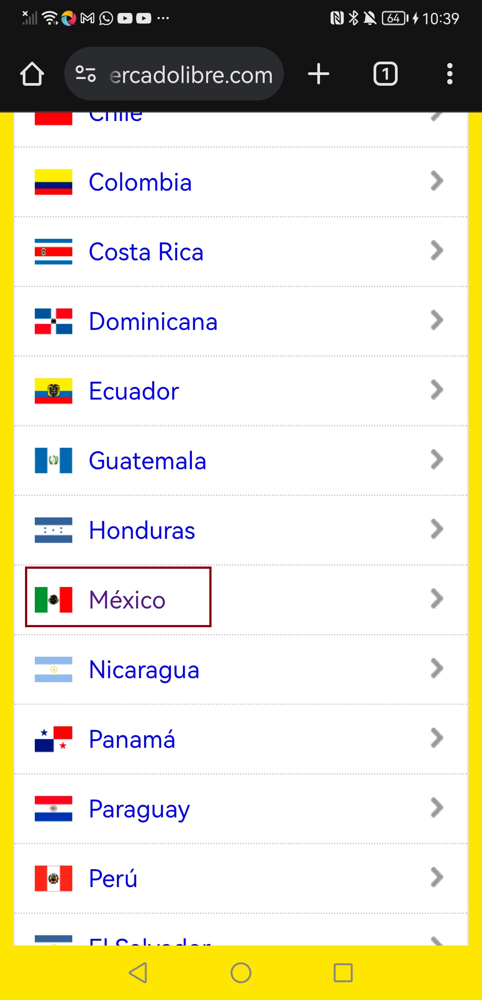
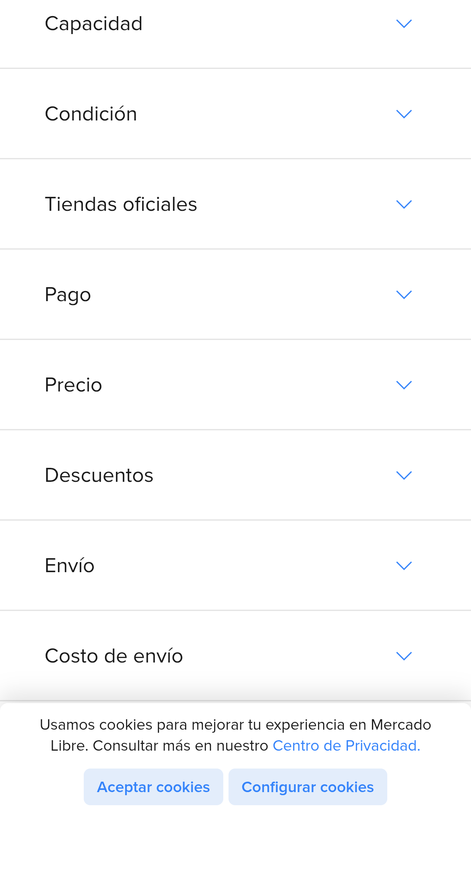
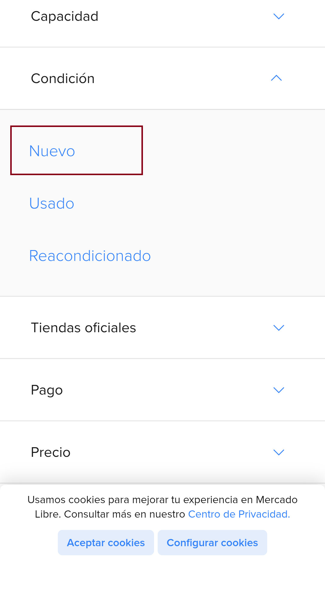
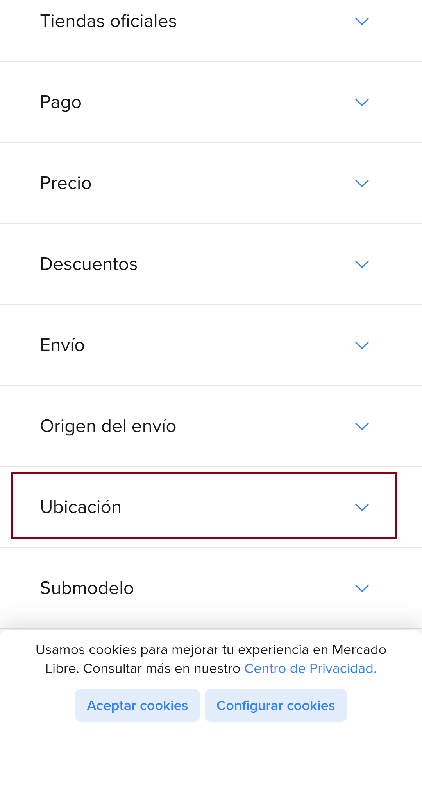
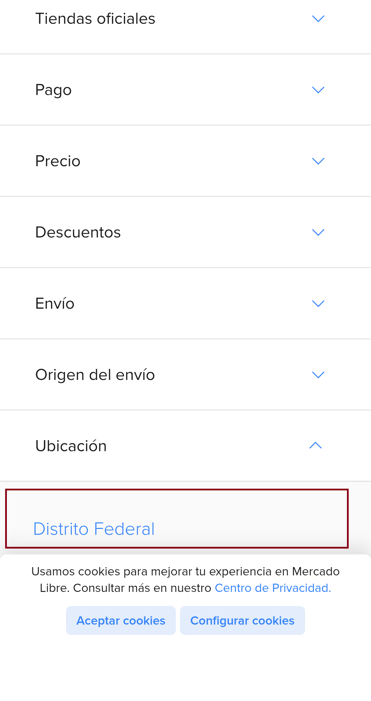
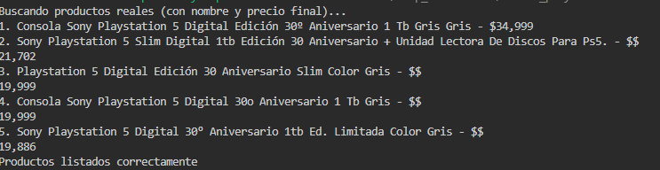

# Automatización Web Móvil - Mercado Libre

Este proyecto automatiza una prueba funcional en el sitio web de [Mercado Libre](https://www.mercadolibre.com), ejecutándose en un navegador Chrome móvil real mediante Appium y Ruby con Cucumber.

---

## ✅ Requisitos

- Ruby 3.x
- Bundler (`gem install bundler`)
- Appium Server v2 (`npm install -g appium`)
- ChromeDriver (se puede usar `--allow-insecure chromedriver_autodownload`)
- Dispositivo Android conectado vía USB con modo desarrollador y depuración activados

---

## 🔧 Instalación

1. Clona este repositorio:

```bash
git clone https://github.com/Feyosan/mercadoLibre-automation.git
cd mercadoLibre-automation
```

2. Instala las dependencias del proyecto:

```bash
bundle install
```

---

## 🚀 Ejecución de la prueba

1. Inicia Appium con descarga automática del ChromeDriver:

appium --allow-insecure chromedriver_autodownload

2. En otra terminal ya sea la del propio VScode o CMD, ejecuta la prueba:

bundle exec cucumber features/search_playstation.feature


---

## 🔍 Qué valida la prueba

1. Abre el sitio de Mercado Libre
2. Selecciona México como país
3. Busca "playstation 5"
4. Aplica filtros:
   - Condición: Nuevos
   - Ubicación: CDMX
   - Orden: Mayor precio
5. Extrae el nombre y precio final de los primeros 5 productos y los imprime en consola

---

## 🧪 Herramientas usadas

- Appium
- Ruby
- Cucumber
- Selenium WebDriver
- Chrome para Android

---

## 📁 Estructura del proyecto

features/
├── search_playstation.feature
├── step_definitions/
│   └── search_playstation.rb
├── support/
│   ├── env.rb
│   └── hooks.rb
drivers/
└── capabilities.rb
Gemfile
README.md


---


## 📋 Steps con Evidencia

### 1. Selección del país
`When selecciono México como país`  


---

### 2. Cierre del popup de la app
`And cierro el popup de la app si aparece`  


---

### 3. Búsqueda del término "playstation 5"
`And busco el término {string}`  


---

### 4. Clic en botón Filtrar
`When toco el botón Filtrar`  


---

### 5. Clic en botón Condición
`And toco el botón Condición`  


---

### 6. Selección de opción Nuevo
`And selecciono la opción Nuevo`  


---

### 7. Clic en botón Ubicación
`And toco el botón Ubicación`  


---

### 8. Selección de ubicación Distrito Federal
`And selecciono la ubicación Distrito Federal`  


---

### 9. Clic en botón Ordenar
`And toco el botón Ordenar`  


---

### 10. Selección de opción Mayor precio
`And selecciono la opción Mayor precio`  


---

### 11. Mostrar los primeros 5 productos en consola
`Then muestro los primeros 5 productos en consola`  



## 👤 Autor

José Alfredo Albarrán Sánchez — [@TuGitHub](https://github.com/TuGitHub)
